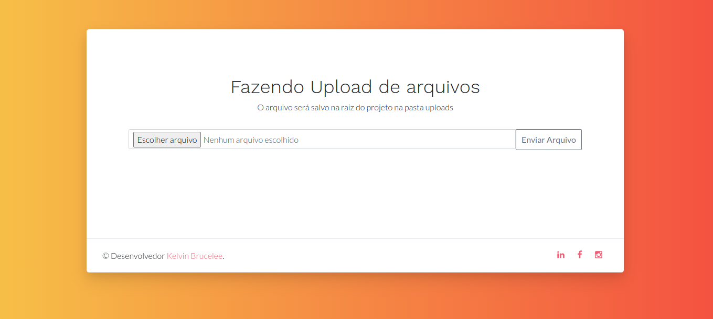

# Upload Node



# Express Multer File Upload

This is a simple Express.js application that demonstrates file upload using Multer middleware.

## Prerequisites

Before running the application, make sure you have Node.js and npm installed on your machine.

## Getting Started

1. Clone the repository:

   ```bash
   git clone git@github.com:kelvinbrucelee/UploadNode.git

2. Install node_modules:
    ```bash
    # using npm
    npm install node

3. Start the node:
     ```bash
    # using npm
    npm start


# File Upload
- The file upload functionality is implemented using the Multer middleware.
- Uploaded files are stored in the 'uploads' directory.
- Access the upload page by navigating to http://localhost:3000/ after starting the server.

## Project Structure

```UploadNode/
|-- assets/
|   |-- css/
|   |-- icons/
|   |-- img/
|   |-- js/
|   |-- vendor/
|-- node_modules/
|-- index.html/
|-- upload.html
|-- .gitignore
|-- package-lock.json
|-- package.json
|-- README.md
```
